# State Machine Diagrams

This document contains state machine diagrams for the stateful components in the peabod-web project.

## Table of Contents

1. [Header Component](#header-component)
2. [Footer Component](#footer-component)
3. [LoginModal Component](#loginmodal-component)
4. [RegisterModal Component](#registermodal-component)
5. [MediaMetadataEditor Component](#mediametadataeditor-component)
6. [Editor Component](#editor-component)
7. [MediaLibraryPage Component](#medialibrarypage-component)
8. [UsersPage Component](#userspage-component)
9. [ThemeProvider Component](#themeprovider-component)

---

## Header Component

The Header manages navigation and user authentication via a hamburger menu.

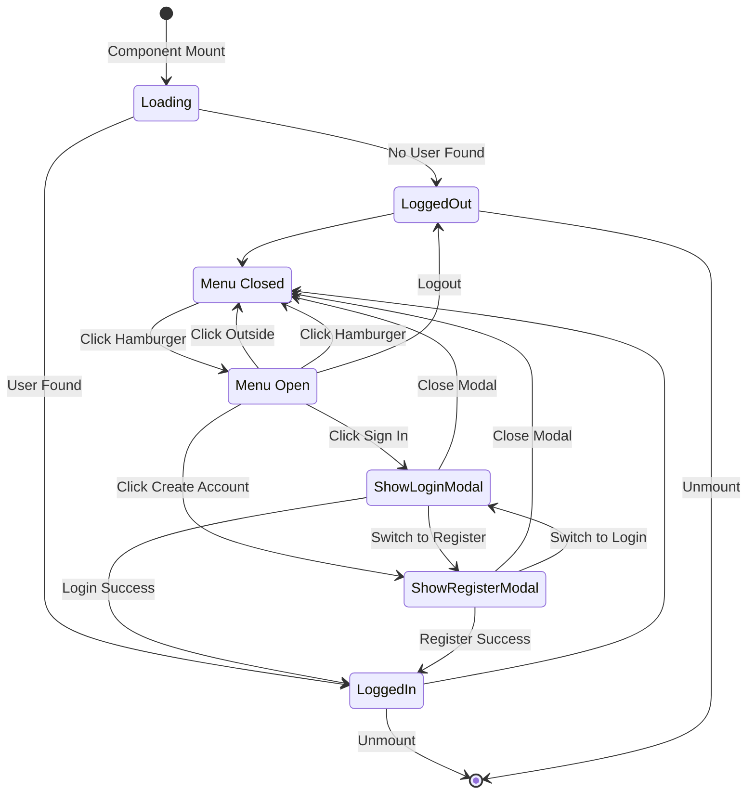

---

## Footer Component

The Footer displays copyright info and provides theme selection via a dropdown picker.

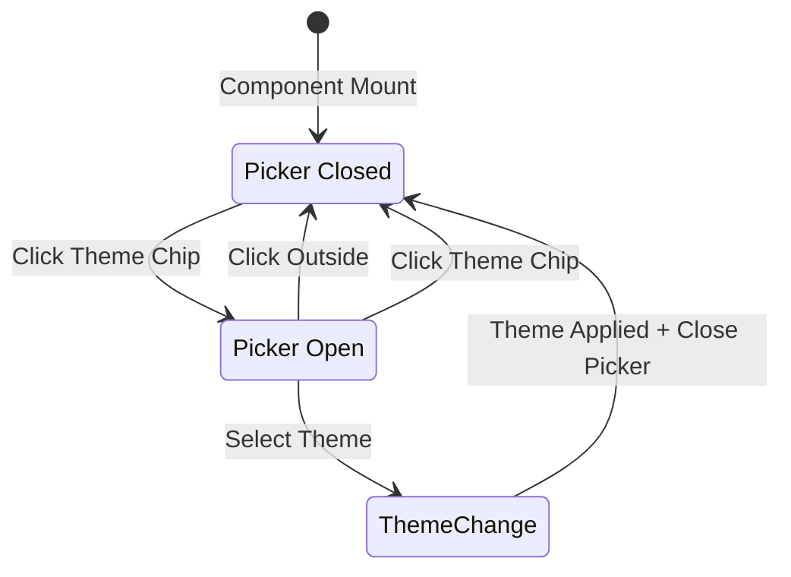

---

## LoginModal Component

Handles the login form submission flow.

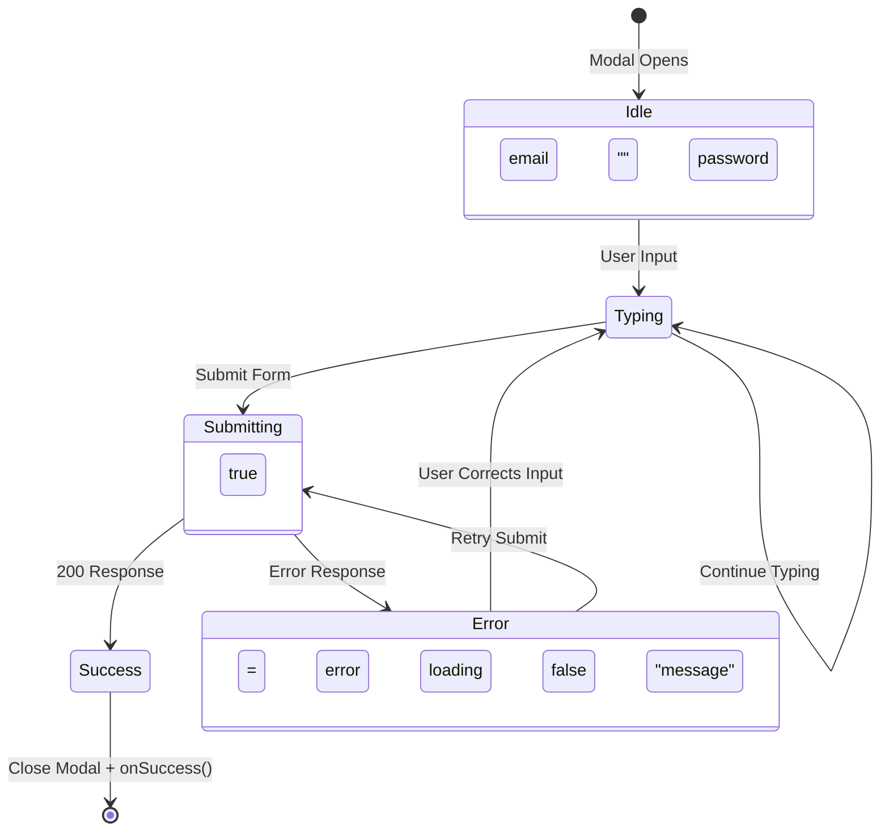

---

## RegisterModal Component

Handles the registration form submission flow.

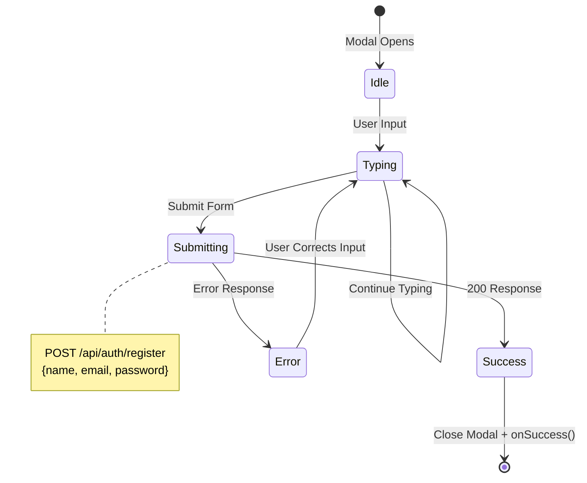

---

## MediaMetadataEditor Component

Complex component for uploading and editing media metadata.

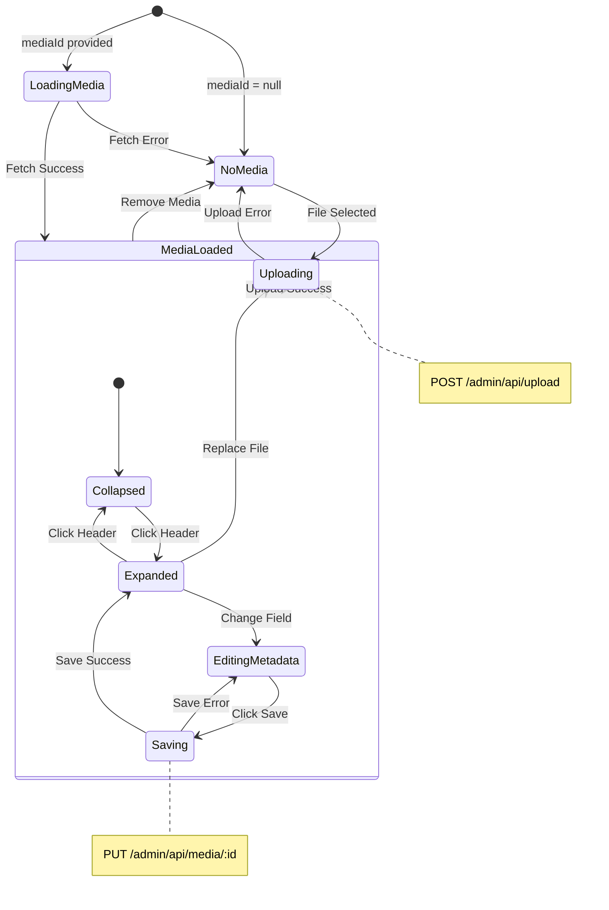

### MediaMetadataEditor State Variables

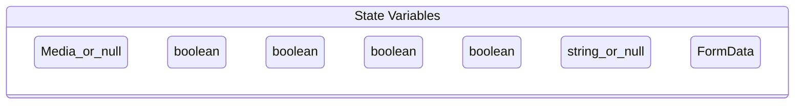

---

## Editor Component

Generic form editor for articles and pages.

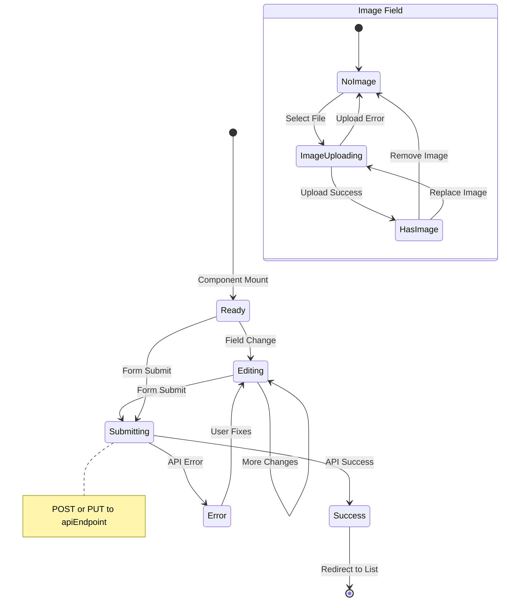

---

## MediaLibraryPage Component

Complex page with filtering, pagination, and CRUD operations.

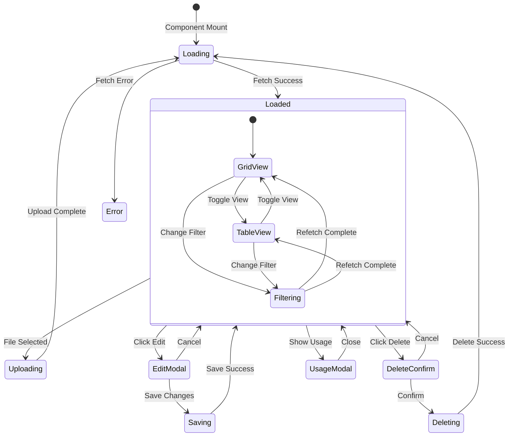

### MediaLibraryPage Filter State

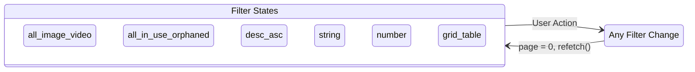

---

## UsersPage Component

Admin page for user management with role and status controls.

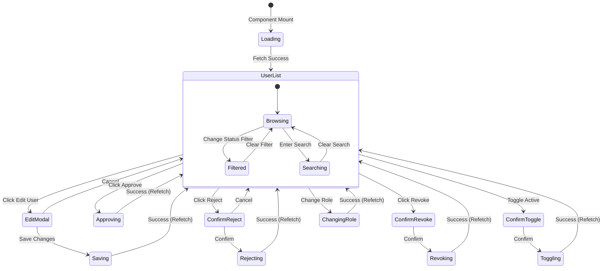

### User Status Flow

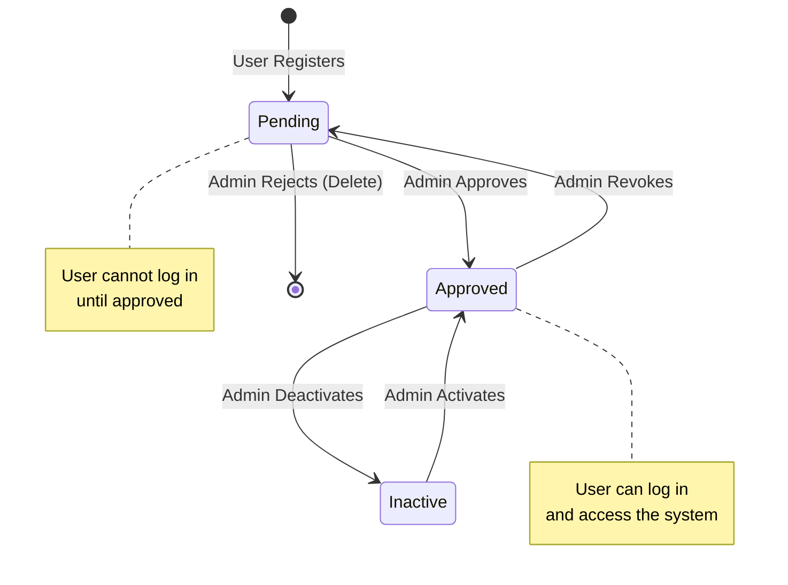

---

## ThemeProvider Component

Context provider for theme management with localStorage persistence.

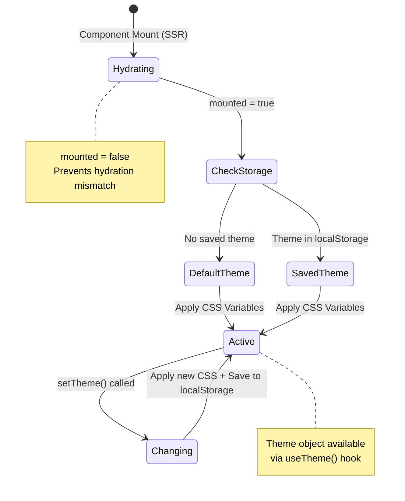

---

## Component Interaction Overview

High-level view of how stateful components interact.

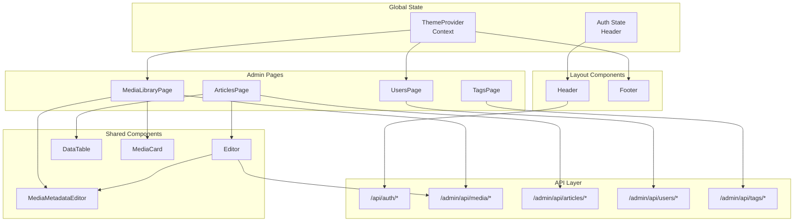

---

## State Management Patterns Summary

| Pattern | Components Using It | Description |
|---------|---------------------|-------------|
| **Loading State** | All pages | `loading` boolean for async operations |
| **Error State** | Editor, MediaMetadataEditor, MediaLibraryPage | `error: string \| null` |
| **Modal State** | AuthMenu, MediaLibraryPage, UsersPage | Boolean flags for showing/hiding modals |
| **Form State** | Editor, MediaMetadataEditor, TagsPage | Object or multiple states for form fields |
| **Filter State** | MediaLibraryPage, UsersPage | Multiple states for filtering/sorting |
| **Pagination State** | MediaLibraryPage | `page` number with total count |
| **Context State** | ThemeProvider | React Context for global state |
| **Optimistic Refetch** | All admin pages | Refetch list after mutations |
